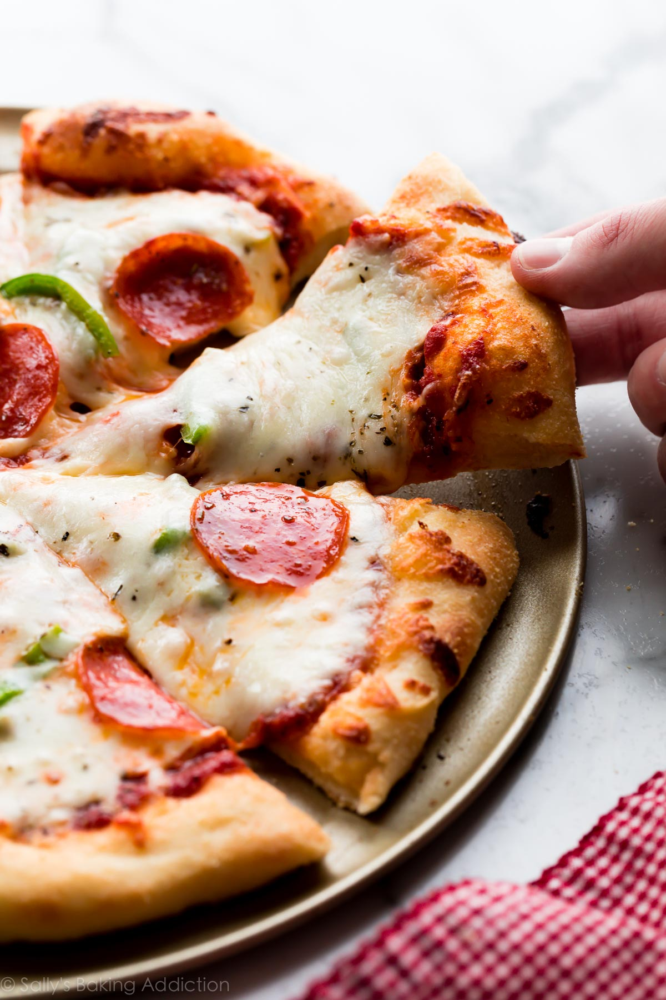

#Pizza
**Ingredients**
All pizza dough starts with the same basic ingredients: flour, yeast, water, salt, and olive oil. Here’s the 
breakdown of what I use in my homemade pizza crust recipe. The full printable recipe is below.

Yeast: I use Red Star Platinum yeast. I have the best results when I use this instant yeast. The Platinum yeast is fantastic because its careful formula strengthens your dough and makes making working with yeast simple. You only need 1 standard packet of yeast (2 and 1/4 teaspoons) to get the job done. Water: I tested this pizza dough recipe with different amounts of water. 1 and 1/3 cups is the perfect amount. Use warm water to cut down on rise time, about 100-110°F. Anything over 130ºF kills the yeast. Flour: Use unbleached all-purpose white flour in this recipe. Bleaching the flour strips away some of the protein, which will affect how much water the flour absorbs. You can substitute bread flour for a chewier pizza crust, but add a couple extra Tablespoons of water since bread flour contains more protein than all-purpose flour. Oil: A couple Tablespoons of extra virgin olive oil adds wonderful flavor to the dough. Don’t forget to brush the dough with olive oil before adding the toppings, which prevents the crust from tasting soggy. Salt: Salt adds necessary flavor. Sugar: 1 Tablespoon of sugar increases the yeast’s activity and tenderizes the dough, especially when paired with a little olive oil. Cornmeal: Cornmeal isn’t in the dough, but it’s used to dust the pizza pan. Cornmeal gives the pizza crust a little extra flavor and crisp. Most delivery pizzas you enjoy have cornmeal on the bottom crust!

**Overview:**
 How to Make Easy Pizza Dough (for bread beginners) Mix the dough ingredients together by hand or use a hand-held or stand mixer. Do this in steps as described in the written recipe below. Knead by hand or beat the dough with your mixer. I like doing this by hand and you can watch me in the video. Place dough into a greased mixing bowl, cover tightly, and set aside to rise for about 90 minutes or overnight in the refrigerator. Punch down risen dough to release air bubbles. Divide in 2. Roll dough out into a 12-inch circle. Cover and rest as you prep the pizza toppings. Top with favorite pizza toppings. Bake pizza at a very high temperature for only about 15 minutes.